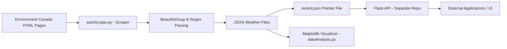

# Python Weather Data Scraper & Visualizer (Archived)

> **Archived Project** – This codebase is no longer maintained due to changes in the data source format. The dataset it generated is still available via the linked API, but no longer feeds an active UI.

---

## Overview
This project was a large-scale **hourly weather data collection and visualization system** for all **444 towns and townships in Ontario**. It combined **web scraping**, **data storage**, **automation**, and **visualization** into a single pipeline, and was designed to be **scalable to other data sources and regions**.

The scraper pulled HTML pages from [Environment and Climate Change Canada](https://www.weather.gc.ca), extracted relevant links, parsed weather details with `BeautifulSoup` and `regex`, and stored each city's weather data in a standardized **JSON format**.

The project’s data powered:
1. A **Python desktop GUI** for visualizing historical weather trends using Matplotlib.
2. A **Flask REST API** ([GitHub Repository](https://github.com/Leosly7663/flaskAPIWeather)) that exposed the dataset for integration into other apps (including a portfolio site).

---

## Features
- Automated **hourly scraping** of all Ontario cities and townships.
- **JSON document storage** for easy document-oriented querying and compatibility with multiple applications.
- Pointer file (`recent.json`) mapping each city to its most recent dataset.
- Matplotlib-powered statistical visualizations of temperature, conditions, and trends.
- Flask API with simple city-based lookup for the most recent data file.
- Designed for **scalability** to other datasets and data sources.

---

## Example Data Format

### Weather Data JSON
```json
{
    "DaysFromMain": 5,
    "Date": "Fri_10_May",
    "dayCondition": "40% Chance of showers",
    "nightCondition": "30% Chance of showers",
    "nightTemp": 8,
    "dayTemp": 15,
    "dateQueried": "2024-05-05",
    "timeQueried": "19h08m"
}
```

### Recent Data Pointer JSON
```json
{
    "Guelph": "Assets/Data/Guelph/Main_2024-08-22_Queried_at_16h13m.json",
    "Ottawa (Kanata - Orléans)": "Assets/Data/Ottawa (Kanata - Orléans)/Main_2024-08-22_Queried_at_16h13m.json",
    "Toronto": "Assets/Data/Toronto/Main_2024-08-22_Queried_at_16h13m.json"
}
```

---

## Architecture & Technologies
**High-Level Flow:**
1. **Scraper** (`autoScrape.py`) fetches HTML → extracts city links → scrapes weather data.
2. **Data Parsing** with `BeautifulSoup` + `regex`.
3. **Storage** in JSON format, with `recent.json` index for quick access.
4. **Visualization** with `dataAnalysis.py` using Matplotlib.
5. **Automation** with GitHub Actions running every hour.
6. **API Layer** (in separate repo) for external data access.

**Tech Stack:**
- **Python** – Core language for scraping, processing, and visualization.
- **BeautifulSoup4**, **requests**, **re** – HTML parsing & HTTP requests.
- **Matplotlib** – Data visualization.
- **Flask** – API backend ([Repo](https://github.com/Leosly7663/flaskAPIWeather)).
- **GitHub Actions** – Automation & scheduled scraping.
- **JSON** – Lightweight, flexible data format.

---

## Installation & Setup

### Development Setup
```bash
# Clone repository
git clone https://github.com/Leosly7663/Weather-Data-Analysis.git
cd Weather-Data-Analysis

# Install scraper dependencies
pip install -r requirements.txt

# Run scraper
python autoScrape.py

# Run visualizer
python dataAnalysis.py
```

### Production / Automated Setup
- GitHub Actions is configured to run `autoScrape.py` every hour on a Linux VM.  
- Generated JSON files are automatically committed to the repository.  
- API repo consumes `recent.json` for quick lookups.

---

## Project Structure
```
.
├── .github/workflows/         # GitHub Actions configs
├── Assets/                    # Auto-generated data storage
├── Logs/                      # Auto-generated logs
├── autoScrape.py              # Main scraping script
├── dataAnalysis.py            # Matplotlib visualization script
├── dataLicense.md             # Data source license info
├── requirements.txt           # Scraper dependencies
├── LICENSE
└── Readme.md
```

---

## API Access
Public endpoints are still available (static dataset):  
Example: [https://flask-apiw-eather.vercel.app/api/Guelph](https://flask-apiw-eather.vercel.app/api/Guelph)

---

## Future Improvements (If Revived)
- Update scraper for new ECCC HTML/data format.  
- Support multiple provinces & countries.  
- Migrate storage to a proper database for historical trend queries.  
- Add interactive dashboards (Plotly/Dash).

---

## License
Licensed under Apache 2.0. See [LICENSE](LICENSE) for details.

---

## Data Flow Diagram

